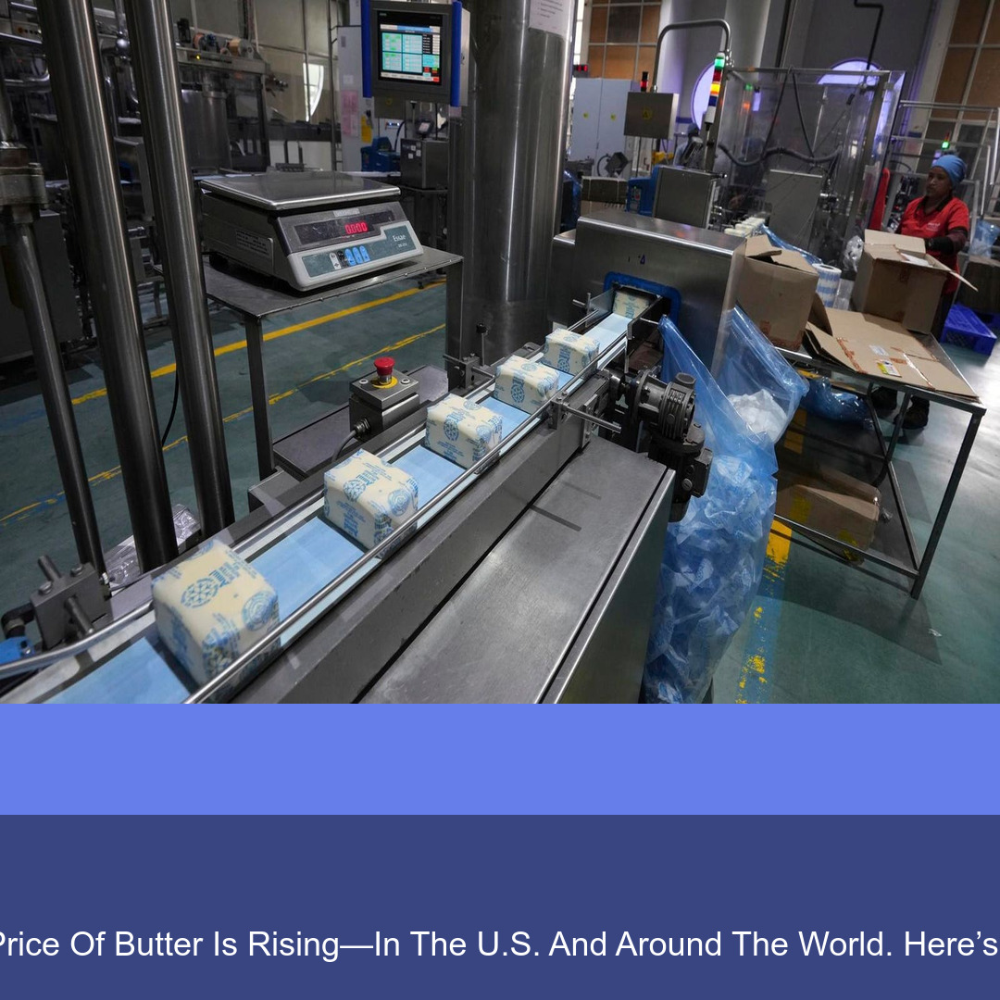

<div align="center">

# 📰 PostGen — Automated Legal News Social Posts

**Turns a news headline into a branded, ready-to-post Instagram graphic — automatically**

A Python content-automation tool for **Law Expert Academy**: pulls current news,
classifies it into a legal practice area, and composites a branded Instagram
post (and a 9:16 Story variant) with theme-matched colors, an AI-generated or
procedural background, headline, excerpt, hashtags, and a ready-to-use caption.

[](https://github.com/bhushan1934/postgen)


</div>

<br>



<br>

*Real output from a run of `generate_post.py` with no arguments — it picked
today's top India headline from NewsAPI (a butter-pricing story, not a legal
one, since that's what was trending that day) and composited it with the
branding template. Shown as-is rather than a cherry-picked example.*

<br>

## What it does

There are two generators in this repo, at different levels of polish:

**`scripts/generate_post.py`** — the simple, reliable path. Fetches the
latest India headline from NewsAPI (or takes a headline + image path
manually), lays it over a two-color gradient with the brand's accent colors,
and saves a 1080×1080 JPEG. No AI image generation, no external image
dependency beyond the headline's own photo — this is the one that's safe to
run on a cron job.

**`instapost.py`** — the more ambitious, AI-enhanced path. It:
- scrapes live legal news (Bar and Bench),
- auto-classifies each story into one of six legal themes (constitutional,
  criminal, corporate, technology, international, education) by keyword
  scoring,
- builds a theme-aware prompt and generates a background image, trying five
  AI providers in order from free to paid (**Pollinations → Dezgo → DeepAI →
  Hugging Face → Stability AI → DALL·E**) and falling back to a procedural
  gradient if every provider is unavailable or unconfigured,
- composites a full branded card (source, theme icon, headline, excerpt,
  exam-relevance callout, CTA, hashtags) in both feed (1:1) and story (9:16)
  formats,
- and generates a ready-to-publish caption with rotating templates and a
  random 12-tag hashtag set.

<br>

## Branding & theme config

`config/branding.json` is the single source of truth for colors, fonts, and
the six legal-theme definitions (keywords → AI prompt → color palette) —
editing it re-targets every generated post without touching the generator
code. `instapost.py` currently keeps its own copy of this config inline
rather than reading the JSON file; consolidating the two is the main
cleanup item if this gets picked back up.

<br>

## Running it

```bash
pip install -r requirements.txt

# Simple path — needs a free NewsAPI key (newsapi.org)
export NEWS_API_KEY=your_key_here
python scripts/generate_post.py                                    # auto-fetch today's top headline
python scripts/generate_post.py "Headline text" path/to/image.jpg   # manual mode

# AI-enhanced path — no API keys required to run (uses the free Pollinations
# tier and falls back to a procedural gradient); add keys in instapost.py's
# CONFIG to enable the paid providers.
python instapost.py
```

<br>

## Notes from this pass

A few things were fixed while documenting this:

- **`generate_post.py` had a live NewsAPI key committed in plain text.**
  Moved to the `NEWS_API_KEY` environment variable — **rotate that key at
  newsapi.org**, since the old one has been in git history on a public repo.
- **`instapost.py`'s theme config was missing the `icon` field** that
  `create_ai_enhanced_post()` and `create_story_variant()` read from —
  running it would have raised a `KeyError` immediately. Added icons for
  all six themes.
- `requirements.txt` was missing `beautifulsoup4`, needed by `instapost.py`'s
  scraper.

Known rough edges, left as-is rather than silently "fixed" for the
screenshot: the AI-enhanced card's dark overlay can make text contrast low
over a busy background image, and emoji glyphs don't render with Pillow's
default font fallback (needs an emoji-capable font bundled in `assets/`).

<br>

## License

All rights reserved — see [`LICENSE`](LICENSE). Shared for portfolio/review
purposes; not licensed for reuse, redistribution, or derivative work.
